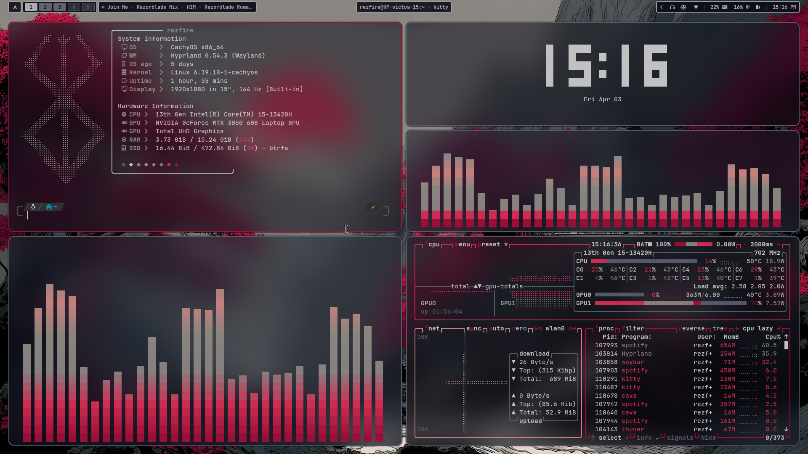
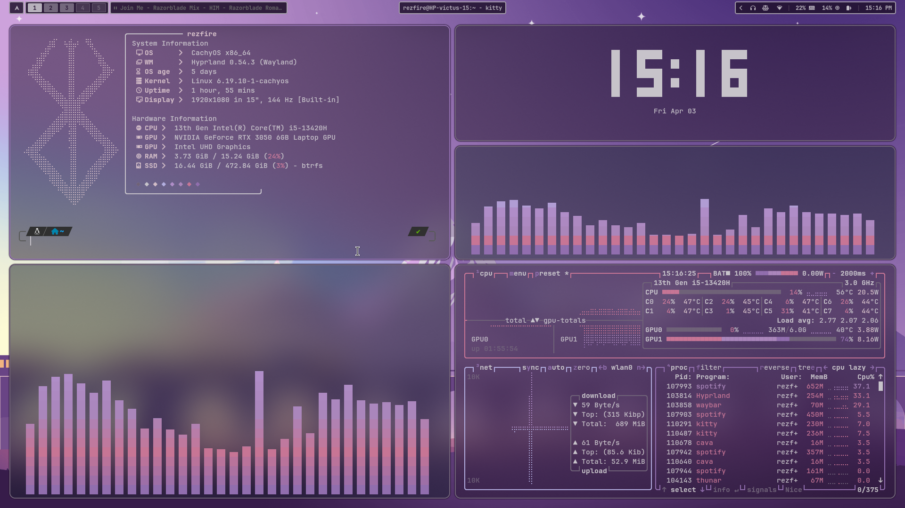
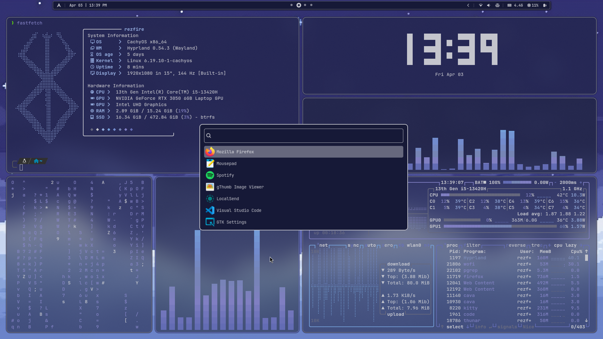
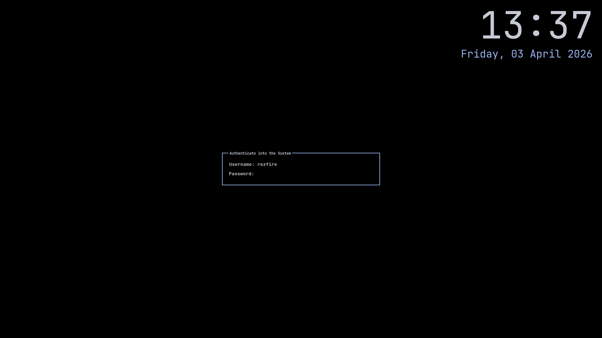

<div align="center">
    <h1>【 LP Hyprland Dotfiles 】</h1>
    <h3>Welcome to my hyprland configuration! this is the setup that purposes is to provide a clean, simple, and nice looking environment  while keeping  its efficent use</h3>
</div>


<div align="center">
    <h2>• preview •</h2>
    <h3></h3>
</div>

<details>
  <summary>Dependecies</summary>

  | Component | Software |
  | ------------- | ------------- |
  | WM/Compositor|[Hyprland](https://github.com/hyprwm/hyprland) |
  | Terminal| [Kitty](https://github.com/kovidgoyal/kitty) |
  | Shell| [ZSH](https://github.com/ohmyzsh/ohmyzsh/wiki/Installing-ZSH)/[theme](https://github.com/romkatv/powerlevel10k) |
  | Bar| [Waybar](https://github.com/Alexays/Waybar) |
  | Launcher| [Rofi](https://hg.sr.ht/~scoopta/wofi) |
  | Wallpaper Utils| [awww](https://codeberg.org/LGFae/awww) |
  | COlor generator| [pywal16](https://github.com/eylles/pywal16.git) |
  | Lockscreen| [hyprlock](https://github.com/hyprwm/hyprlock) |
  | AUdio Visualizer| [cava](https://github.com/karlstav/cava) |
  | Notification| [swayNC](https://github.com/ErikReider/SwayNotificationCenter.git) |
  | Font| [JetBrainsMono Nerd font] |


</details>

<details> 
  <summary>Installation Guide</summary>


1. Install the required dependecies:
    ```bash
    sudo pacman -S hyprland hyprlock hypridle kitty rofi waybar zsh cava swaync ttf-jetbrains-mono ttf-jetbrains-mono-nerd 
    ```

    ```bash
    yay -S python-pywal16 awww-git
    ```

2. clone this repository
    ```bash
    git clone https://github.com/Lemari-Plastik/LP-dots
    ```

3. copy/move the configuration file to the place it should be
    ```bash
    cd LP-dots
    cp -r .config/* ~/.config/
    ```

4. restart your session and enjoy the setup!

*P.S: i reccomend to use "wal -i ~/,config/wallpaper/the-image.jpg" in order pywal16 to work properly, good luck*

</details>

<div align="center">
    <h2>• screenshots •</h2>
    <h3></h3>
</div>

This is the screenshot of the setup


| Setup   | Setup 2 |
|:---|:---------------|
|  |  |
| Launcher | Hyprlock |
|  |  |


<div align="center">
    <h2>• thank you •</h2>
    <h3></h3>
</div>

 - [@end_4](https://github.com/end-4) for making the readme templates
 
<div align="center">
    <h2>• copying •</h2>
    <h3></h3>
</div>

 - Copying: Absolutely, feel free. Just follow the license and it's all good
 
